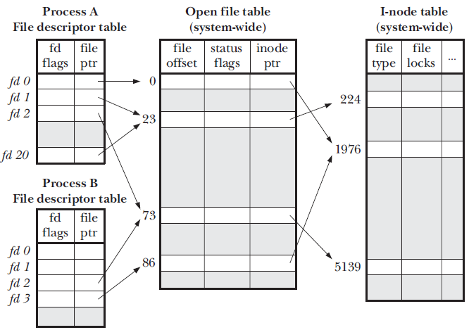
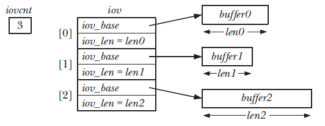

# File Input and Output 

File to document that File I/O in the Linux Operating System

## Atomicity and race condition 
All system calls on the operating system are guaranteed to run atomically. OS ensures that all steps of the system call will be run as a single unit without being interrupted by another process or thread.

The operations of open() and write() are subject to race conditions. There are flags that can help with dealing with race conditions like the O_APPEND which ensures that the file is appended to rather than seeking a location and then appending programatically. 

## File control operations fcntl() 
This system call does a wide range of operations on the file descriptor. 

``` 
int fcntl(int fd, int cmd, ...) 

/*  cmd indicates the command to run on the file descriptor and the ellipsis indicates the arguments. 
    also this system call ensures that the command you specify runs atomically. 
*/
```

One of the use cases for the use of fcntl() is to change the access mode of the file and this is relevant in 2 scenarios: 
* file was not opened by the calling programming, so the program has no control over the flags used in the open() call. 
* the file descriptor was obtained from a system call other than open() like a pipe or socket. 

```
flags = fcntl(fd, F_GETFL); 
if(flags == -1) 
    errExit("fcntl"); 
flags |= O_APPEND; 
if(fcntl(fd, F_SETFL, flags) == -1)
   errExit("fcntl"); 

```

## Relationship between file descriptors and open files 
There can be multiple file descriptors to one open file and many a times it is necessary. For this to happen the kernel has 3 data stuctures: 
* per process file descriptor - this olds reference to an open file descriptor for the current process. 
	* holds a set of flags controlling the file desc. 
	* a reference to the open file descriptor 
* system wide table of open file descriptions - this is a system wide opn file table that hold handles to all files open in the system. This table holds information like: 
	* current file offset 
	* status flags set at the time of opening the file. 
	* the access mode of the file. (read only, write-only etc.) 
	* settings related to signal driven i-o 
	* reference to the inode object.  
* file system i-node table - an inode signifies the presence of a file on the operating systems file system. It holds information like: 
	* file type (FIFO, regular, socket etc) and permissions 
	* a pointer to a list of locks on the file. 
	* various properties of the file including its size and timestamps relating to different types of files. 



* In process A descriptors 1 and 20 both refer to the same open file descriptor 23 and this can occur when we call the dup() or dup2() methods 
* Descriptor 2 of process A and B point to the same file descriptor 73. This scenario occurs when we have a fork() command being executed. 
* Descriptor 0 or process A and descriptor 3 in process B point to different opne file descriptors 0 and 86 but both these eventually map to one inode 1976. this scenario occurs when we call open() on same file from different processes. 

## Duplicating File Descriptors 
This is relevant when we run direction commands like the following: 
```
   $> ./myscript > result.log  2>&1 
```
in the command above we want the output of the script to be redirected to the result.log file as well as the standard error (2) to the file results.log
For the desired result the file descriptor 2 needs to be duplicated and must refer to the standard output (1) this is not the same as opening the result.log twice once with descriptor 1 and other with descriptor 2. Instead the use of dup() or dup2() is used. 

**dup()** - this method takes a argument which is the old file descriptor and returns the lowest unused descriptor. Through this method we have no control over what the new fd would be. 
```
   int dup(int oldfd);   # returns new fd on success and -1 on failure. 
   /*
      if we assume that the process has already started a process with 0,1,2 fd taken and we call the 
      dup(1) system call the method should ideally return 3 as the new fd.
      if however we need to get 2 in return we need to close it before we call the dup() 
      
      close(2); 
      newfd = dup(1);  # newfd should be 2.
   */
```

**dup2()** - dup2 was released to overcome the limitation of dup() and this method takes the old and new fd as input. if the newfd passed is a file descriptor that is already open then the dup2 method will close it and then open the new file descriptor that is a duplicate for oldfd. 
```
    int dup2(int oldfd, int newfd);   # returns new file descriptor or -1 in case of failure) 
```

## Read and Write at specific offset 
This is possible using the pread() and pwrite() methods 
```
ssize_t pread(int fd, void *buf, size_t count, off_t offset); 
            # returns the number of bytes written 0 on EOF and -1 in case of failure. 

ssize_t pwrite(int fd, void *buf, size_t count, off_t offset); 
```
These are execllent options if you want to seek an offset and then write or read a file. The cost of one single  pread or pwrite is less than 2 system calls i.e. lseek() followed by a read() or write() call. 

## Scatter Gather i/o | readv and writev calls.
In general for read and write methods that we have seem earlier there is a single buffer that the data is written too or read from. However readv() and writev() allow for multiple buffers to set to be written to or read from 

```
ssize_t readv(int fd, const struct iovec *iov, int iovcnt); 
                    # returns the number of bytes read 0 in case of EOF and -1 in failure. 
ssize_t readv(int fd, const struct iovec *iov, int iovcnt); 

/**  the iovec structure is as follows*/
struct iovec{
  void *iov_base /* the starting address of the buffer*/
  size_t iov_len /* number of bytes to transfer to-from buffer*/
}

```
in the code above each buffer has a length given by **iov_len** specified in the structure where as number of buffers is specified by iovcnt which is give as apart of the method call.  



### Scatter 
In the case of readv the kernel will read the data block from file specified by the file descriptor and then scatter the content on to the buffers that have been specified by the iov structure. 

### Gather 
In the case of writev will gather all the data from the buffers specified in the structure and then write the data to contiguous memory location on the file. The order of write is the same as the one given in the structure. 

In addition to readv and writev there are **preadv() and pwritev()** methods as well that will read and write buffers to and from offsets. 


## Truncating file | truncate and ftruncate 
truncate and ftruncate will set the size of the file to the value specified by the length. 

```
int truncate(const char *pathname, off_t length); 
int ftruncate(int fd, off_t length); 
```

if the size of the file is more than the length specified the excess data is lost and if the size if less than the length specified then the extra space is padded with null bytes. 


## Nonblocking i/o 
The non blocking flag O_NONBLOCK on a file serves two purposes: 
* If the file can't be opened immediately, then open() returns an error instead of blocking. e.g. is opening a   FIFO file. 
* after opening a file subsequent operations on them will also be non blocking. if the system call can't complete immediately, then either a partial data transfer will be initiated or a system call fails with one of errors EAGAIN or EWOULDBLOCK. 

Nonblockign mode can be used with devices (terminal) as well as pipes, FIFO and sockets. O_NONBLOCK generally igonores regular files, because the kernel buffer cache ensures that I/O on regular file does not block. However in the case of mandartory locking this flag is essential. 

## I/O on large files 
The off_t data type which is used to hold the current offset to a file is typically implemented as a signed long integer. due to this the off_t on a 32bit architecture can only handle 2GB files at maximum. To overcome this limitation the LFS (large file summit) was set up to make specification to handle larger files. 
As a result 64 bit version of off_t were instituted which can handle much larger files. 

There are 2 ways LFS functionality can be handled: 
1. use an alternative API to support large files. this was a transitional approach and is now obsolete. 
2. define the _FILE_OFFSET_BITS macro with value 64 when compiling our programs. This allows for the program to handle large files with not change in source code. 

The file offset bit setting  can be achieved by: 
```
   $ cc -D_FILE_OFFSET_BITS=64 prog.c 

   /* define the value in the file itself.*/
   #define _FILE_OFFSET_BITS 64 
```

With the setting made above the calls like open() are converted to open64() etc. Another problem with sending off_t to printf under the LFS but we need to use long long as a cast

```
#define _FILE_OFFSET_BITS 64
off_t offset; 

printf("offset=%11d\n", (long long) offset); 
```

## The /dev/fd directory 
For each process the kernel provides a virtual directory /dev/fd/n where n denotes the file descriptor used by the process.

opening any of the /dev/fd/n files is equivalent to duplication of that file so the following bits of code are the same. 

```
  fd = open("/dev/fd/1", O_WRONLY); 
  fd = dup(1); /* Dupliacting std out*/ 
```

> /dev/fd is actually a symbolic link to Linux specific /proc/self/fd directory which is also linked to /proc/PID/fd which contains the links to all the files opened by the PID. 

To make it easier to under stand the /dev/fd/0, /dev/fd/1 and /dev/fd/2 are pointed to by the following links respectively  /dev/stdin, /dev/stdout and /dev/stderr

## Creating Temporary files 
there are various programs that need to create temp files during their processing which need to be deleted at the end of the program. The system call mkstemp() helps with this functionality. 

```
int fd; 
char template[] = "/tmp/somestringXXXXXX";

fd = mkstemp(template); 
if (fd ==-1) 
   errExit("mkstemp"); 

printf("Generating filename: %s\n", template); 
unlink(template);   /* this will make name disappear from directory but file is removed only on close.*/

/*  Use file i/o to read and write to the file. **/

if( close(fd) == -1) 
    errExit("close"); 
```

the file name provided has 6 'X' and they are replaced by the kernel to make the file name unique. 


