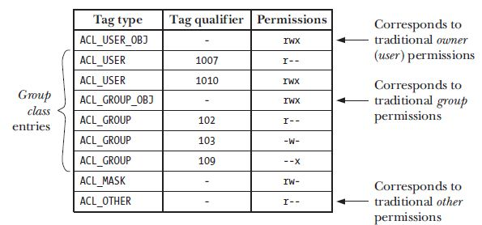

# Access Control Lists 

ACL implementation on Unix/Linux systems are no consistant and each file system implements them in
a slightly different way.

## Overview 
An ACL is nothing but a series of table entries with the following column types: 
1. Tag type - this specifies that whether the ACL applies to a user, group or some other category. 
2. Tag qualifier - specifies a specific user or group and is option attribute
3. permission - specifies the permission that the user or group is assigned. 

#### ACL entries 
* ACL_USER_OBJ - this maps to the permissions granted to a file owner. Each ACL table contains just
  one entry for this tag type. 
* ACL_USER - this maps to a particular user based on the tag qaulifier entry which specifies the
  user id for a particular user. There can be multiple entries of the ACL_USER but ACL_USER tag and
  the tag qualifier need to be unique i.e. there cannot be more than one ACL_USER entry for a user
  id. 
* ACL_GROUP_OBJ - this is the specific permissions granted to the file group. each ACL table
  contains just one ACL_GROUP_OBJ entry. 
* ACL_GROUP - here we can have an entry in the table corresponding to each group id. 
* ACL_MASK - specifies the maximum permissions that the ACL_USER, ACL_GROUP or ACL_GROUP_OBJ can
  specify. there is atmost one entry for ACL_MASK in the ACL table entry. 
* ACL_OTHER - This entry is for premissions that are granted to users that don't match any other ACL
  entry. this maps to the other permissions. 

The table shown above minimal ACL and it maps directly to the traditional file permission system in
Linux. However we can extend the ACL system (extended ACL). the extended ACL is managed using the
extended attributes functionality in Linux and entries are made to the system.posix_acl_access.
Minimal ACL can be stored in traditional file systems. 

## ACL permission checking algorithm
The algorithm works in the following steps: 

1. If the process is previledged then all access is granted. There is one exception to this rule
   however. When executing a file, a previledged process is granted execute permission only if that
   execute permission is granted by atleast one ACL entries on that file. 
2. if the effective user ID matches that of the owner of the file then the permission specified in
   the ACL_USER_OBJ entry is applied to the file. 
3. If the effective user id of the process matches that of a tag qualifier in one of the ACL_USER
   entries, then process is granted permissions specified in the entry masked (ANDed) against the
   ACL_MASK entry. 
4. If one of processes group ID (or effective group IDs) matches that of the file group (ACL_GROUP's
   tage qualifier or ACL_GROUP_OBJ) then the following sub steps are followed.
   	* if the process group id matches the file group and ACL_GROUP_OBJ grants the persmission
	  this is ANDed with the ACL_MASK
	* if one of the processes group id matches the tag qualifiers in the ACL_GROUP entries. then
	  that entry determines the permissions and is ANDed with the ACL_MASK
	* other wise the access is denied. 
5. Otherwise the process is granted permissions speficied in the ACL_OTHER entry.

