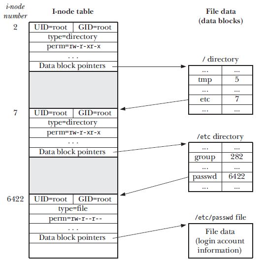
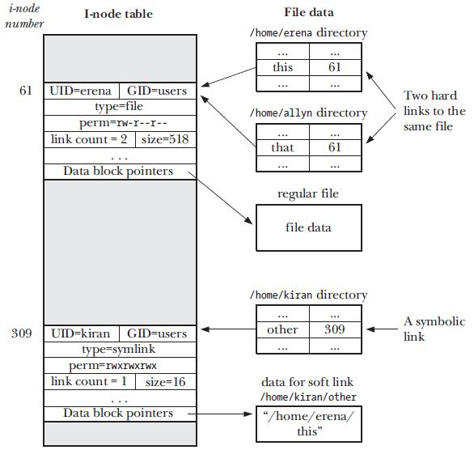

# Directory and Links 

## Directories and Hard links 
A directory is stored in the file system similar to a regular file. There are 2 things the
distingush a regular file from directory: 
* A directory is marked with a different file type (d) in its i-node 
* A directory is a file with special organization. It is essentially a table consisting of filenames
  and i-node numbers. 

A process in Linux cannot read or write to the file using the read()/write() system calls but can
change the directory using the rmdir(), symlink(), unlink(), open() system calls. 

The diagram that follows contains the directory and inode entries for the /etc/passwd file: 

On the Linux system the / root file system is always represented by the inode number 2 so tha the
kernel knows where to start. 
As you can see the structure above the file i-node does not contain the file name which is
essentially in the data block that points to the file content therefore we can have multiple links
(names) pointing to the same i-node for a file. 
Other operating systems like windows does not support likes either hard or soft. 

The ls command can give you the inode number using the -li option. The first entry with the -li
option is the file is the inode number of the file. 

The inode entry and the data blocks for file are only removed once the link count falls to 0. This
when all the names of the files are deleted. So the rm command does the following: 
1. removes a file name from a directory list, decrements the link count of the corresponding inode
   by 1. 
2. if the link count thereby falls 0, deallocates the i-node and the data blocks to which it
   refers. otherwise the i-node is left intact. 

The answer to the question - How can I find all the filename associated with a file descriptor x in
my program is you cannot at the inode does not contain file name or link name. 

Hard links (created by command ln) have two drawbacks 
* because a hard link refers to the file inode number, which inturn are only unique within a file
  system in which they are used. Therefore the hard link must reside in the same file system
* A hard link can only be made to a file and not a directory to avoid the problem of circular links. 

## Symbolic Links 
Symbolic links are sometimes called soft links, is a special file whose data is nothing but the name
of another file. Diagram below shows the different between soft and hard links. 

The soft link data can be either a absolute path or a relative path to the location where the
symbolic links resides. The symbolic links differ from hard links in the following ways:

* that is soft links are not part of the link count to a file. Therefore a file can be deleted 
insite of a symbolic link being still present. In this case the link is called a dangling link. 
* Since the soft link data is a path name and not a i-node number it can refer to files that are
  part to a different file system. 
* Symbolic links can also refer to directories unlike hard links. 
* soft links can be referenced to other soft links in a chain where a can refer to b and b refer to
  c and the kernel will derefence the links to get to the right file. 
	* there are however limits to the number of chains that are allowed e.g. Kernel 2.6.18 and
	  later allow 8 link chains where as for an entire path there can be a max of 40
	  dereferences. 

There are several system calls in Linux that allow link dereference were as there are some that do
not allow for them. 
When it comes to file permissions that soft links permissions are not important. The file
permission on the dereferenced file determines the access. However the soft links access is used in
the case where the link itself needs to be deleted. 

