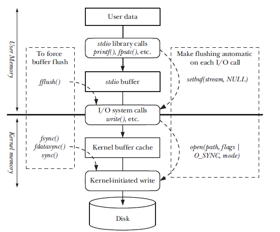

# File IO Buffering

As write operations are slow when compared to reads because of the disk. A technique of storing the data in a cache that will later be written to the disk is called buffering. There are times when the buffering can be let go and technique called direct io can help. 

## Buffer Cache 
In order to make the read and write operations in the Kernel faster Linux has a datastructure called buffer cache where data is either written to temporarily or read from disk (read ahead) so that the I/O are not slow.
* In the case of write the kernel will write the data to cache and write method will return immediately but the data written to the cache will be written at once. Similarly in read operations too the data can be stored in the buffer cache and in order to keep data in cache read ahead operations are performed. 

Benchmarks do show that the larger the buffer cache the better the performance but we need to make a balance. 

## Buffering the stdio library 
stdio library functions will buffer data to reduce system calls (e.g. fprintf(), fscanf(), fgets(), fputs(), fputc(), fgetc()). Thus the stdio library relives us from the task of buffering data output when using write() or input when using read() methods. 

### Setting the buffering mode of stdio stream 

**setvbuf()** 
```
int setvbuf(FILE *stream, char *buf, int mode, size_t size); 
```
setvbuf() effects all stdio methods once it is called. The arguments to the method are: 
* stream - file stream to which the buffer needs to be applied generaly the output or input stream. 
* buf - if not null then points to block of memory that needs to be used to buffer the content. if howevery the buf is null then the stdio library automatically allocates a buffer. 
* mode - determines the type of buffering needed. 
	* _ IONBUF - Don't buffer content call system calls immediately when the data arrives. This can be useful in the case of error streams. 
	* _ IOLBF - employ line buffer mode where each line is buffered. This is useful in the case of terminal commands. 
	* _ IOFBF - employ full buffer which means copy data that is equal to the size of the buffer before the system call is made. 

**setbuf()** 
this function is layered on top of setvbuf and performs a similar task. 
```
void setbuf(FILE *stream, char *buf) 
```
The setbuf() is similar to setvbuf(fp, buf, (buf != NULL) ? _IOFBF: _IONBF, BUFSIZ); 

### Flushing the stdio buffer 
fflush(FILE *stream);  method will flush all stdio buffers. 


## Controlling Kernel Buffering of File i/o 
Sometimes the it is necessary to fush kernel buffers to ensure that the data has been commited to disk as is the case with database journalling. 

### Synchronizing i/o data integrity and sync i/o file integrity. 

* sync i/o data integrity completion - this is concerned with ensuring that a file data has been transferred to the process. 
	* In the case of read operations it means that the requested file data has been transferred from the disk to the process. If there are any pending write operations they must complete before the read operation is executed. 
	* For write operations it means that the data to write has been transferred to the disk and the file meta data has been updated too which will be needed for further read operations to be complete. 

* sync i/o file integrity completion - this insures that the file meta data is transfered to disk in addition to the data being commited to disk, even if there is no subsequent request for read operation on the file. 

## System calls for controlling kernel buffering of file i/o 

**fsync()**  - this method call causes the buffered data and all metadata associated with the open file descriptor fd to be flushed to disk. Calling fsync() will force the i/o file integrity completion state. 

**fdatasync()** - this method call is related to the i/o data integrity completion state only. 

### Making all writes synchronous | O_SYNC 
specifing the O_SYNC flag at the time of file opening will cause all writes to the file to be synchronous. All writes to the file opened with O_SYNC flag will cause it to flush the buffers. 

O_SYNC flag is an expensive proposition as the writes become very slow as each write has to ensure that the buffer is written to the disk. Therefore a better approach is not to use O_SYNC flag and using the fsync() methods judiciously. 

## Summary of i/o buffering 

The following diagram shows how the i/o buffering works. If we follow the diagram in the middle it shows where the data travels before it is stored. 
1. The first place the data comes is the stdio libray. 
2. this is followed the data being in the buffer cache for stdio 
3. Once the buffer cache is read to be written the data passes to the kernel memory 
4. Once in the kernel the data moves to teh kernel cache before is it writen to disk when the kernel initiates a write. 

The diagram also shows how the different methods discussed earlier effect the movement of data through the stack. 



[Next](file-system.md)
