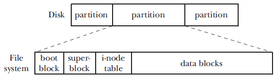
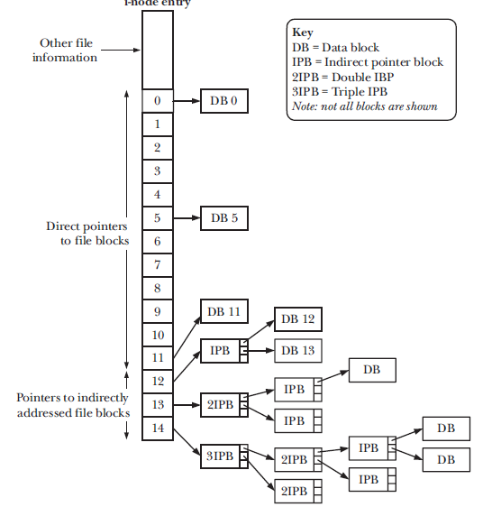
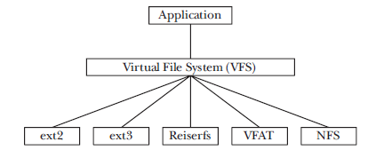
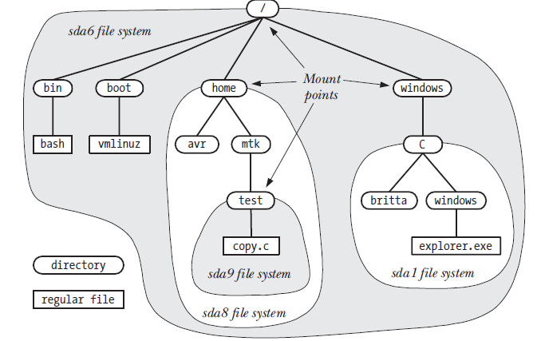

# File Systems 

## Device files 
Every device on the Linux like the mouse, disk etc has to be represented as a file and this file is called a device file. The location of such a file is /dev folder. THe device files are managed by programs called device drivers. 
Device drivers are program that are unit of kernel code that implements a uniform interface that allow for the following functions: 
* open()
* close()
* write()
* read()
* mmap()
* ioctl()

Because this interface is consistant the devices can be controlled in similar fashion. 

### Devices are of two types 
* character device - these are devices that handle characters and example being the terminal devices. 
* block device - deal with data input and output on blocks e.g. disk devices. 


## Disks and Partitions 
Disk drives more often than not mean the hard disk that supports the entire system. Each disk is generaly divided into partitions. Each partition that is created on the disk drive is treated as a separate device on the linux system and can be seen under the /dev folder. 

The system admins use the fdisk command to create such partitions on the disk. Each disk partition consists of 3 areas: 
* a file system which holds regular files and directories. 
* data area - accesses as raw mode device 
* swap area - area on the partition that is used by the kernel to do memory management. 

## File Systems 
file system is nothing but an organised collection of regular files and directories and the file system can be cerated using mkfs command. Linux supports a lot of file system types. 
* ext2 - extendend file system 2 
* minix, system v and BSD fs 
* microsoft's  FAT, FAT32 and NTFS
* ISO 9660 
* Apple Macintosh HFS 
* range of network file systems like NFS, Novell's NCP, Coda file system etc. 
* journalling fs like ext3, ext4 , btrfs, xfs, jfs etc. 


The following diagram shows how the file system and partition look together 



From the diagram above we have the following blocks on each parition: 
* boot block - this is always the first block on a partition and is never used by the file system it is for the kernel. Although kernel does not read from all partions but just one. So a lot of the boot block is not used. 
* superblock - This block has meta data about the file system and configurations. 
	* the size of the i-node table 
	* size of the logical block of the file system. 
	* the size of the file system in logical blocks. 
* i-node table - inode table is the place where information of all the files and directory in the system are stored. the inode table is also sometimes called the i-list. 
* data blocks - this is where the raw files and directory data lies. the structure of ext2 is a little different because on ext2 super, inode table and data blocks are all part of a block group which is made to reduce seek times. 

## inodes 
On a Linux file system each file is denoted by a data structure called inode at the kernel level this data structure has the following information that it keeps: 
* file type (directory, regular files, fifo, character device or symbolic link) 
* Owner of the file (UID) 
* Group that the file belongs too (GID) 
* Access permissions for the three categories of user, group and others. 
* 3 time stamps about the files: 
	* last access time. 
	* last time the file was modified
	* time of the last status change. 
* Number of hard links to the file. 
* Size of the file in bytes 
* Number of blocks allocated to the file measured in units of 512 byte size. 
* Pointers to the data block. 

### inodes and data pointers on the ext2 system. 
Every file in Linux file system keeps track of the data blocks that are assigned to the file by keeping a list of pointers to the data blocks that are assgined to the file. 
It is important to note the that data on the files are never stored in contiguous memory locations as it is highly inefficient to do so in practice. Therefore blocks of data are assigned in incontiguous memory locations (buddy algorithm for assignment is used). This may lead to fragmentation of memory on the disk but this is very efficient in space usage. 



As you can see in the diagram above there are 15 pointers that the inode keeps for holding the pointers to the blocks of data. The first 12 pointers on the structure are directly to the first 12 blocks of the file. the 13th location on the inode data block poitns is a pointer to another set of pointers to data blocks that makes for the first level of indirection. The number of data blocks that the file system uses determines the number of datablocks that the 13th position can save e.g. if block size of ext2 is 1024 then the 13th position pointer can hold upto 256 blocks of memory and 1024 blocks in the case the size is 4096 bytes. 

If the file is still larger for the pointers in the 13th position then the 14th position pointers has even more locations to store the data as it is a double indirection pointers meaning it holds a pointer to pointer of blocks that hold pointers to the actual data block. If we still have a larger file on the system then the 15th location is used which is a 3 level of indirection. 

In a sense if the block size on the file system is 4096 then the largest file that ext2 system an hold is 4 Tera bytes. 


## Virtual File System (VFS) 
As the Linux operating system has been built to support multiple file sytems. To do this Linux has built a Virtual File system (VFS) interface which it enforces on to each file system that needs to work with Linux. Therefore the device drivers that actually interact with the file system at a lower level build primitives that the VFS exposes to applications that run on the Linux OS. There are several operations that the VFS supports that the file system device driver needs to support as well e.g. write(), read(), truncate(), mount(), unmount(), mmap(), link(), unlink(), symlink(), rename(), lseek(), close() etc. 

However not all file system support all these operations e.g. on Microsoft's VFAT file system there is no support to create symbolic links therefore the symlink() call to the device driver of VFAT system on Linux returns an error. 




## Journalling File Systems
In traditional FS like the ext2 a lot of data about the files are kept in the Kernel data structures before it is flushed to disk. Due to this design these file systems (including ext2) are vulnerable to system crashes after which a consistency check needs to be performed. This check looks for file meta data incosistency and not for data that may have been lost. 

Journalling FS are step towards achieving file meta data consistency which can survive system crashes and this is done using journalling that writes the state of file to disk and there is no need to run consistency checks when the system crashes. There are a number of journalling file system that can be used: 
* ext3/ext4 - these are journaling file systems that have a lot of features the ext4 has some features like feature to allow contiguous memory to prevent disk fragmentation, online FS defragmentation, faster file system checking and support for nano second timestamps. 
* Btrfs (butter fs or B-tree FS) features like extents that ext4 gives, checksums on data and metadata online file system checking. space efficient packing of small files, space indexed directories. 

There are other file systems with the journalling capabilities like XFS and JFS. 


## Single Directory Hierarchy and Mount points 
On Linux as well as Unix all filesystems reside under a single directory tree. At the base of the tree is the root directory, /(slash). Other file systems are mountes on top of the root directory. The command to mount is given below 

```
$ mount device directory 
``` 

With newer linux versions kernel supports mounting file systems per process basis using the mount namespace construct. This means that each process can have its own set of file system mount points, this leads to a different file system for each process (potentially). 

The diagram give a representation on how the file systems can look: 

 


## Mounting and Unmounting File systems 
There is a command each for mounting and unmounting a file system namely mount and unmount. There are a few file s we need to consider before we look at the details of these commands. 

1. **/proc/mounts** - this file is used to hold the mounted file system information on Linux. With the advent of containers and file system mounts per process the mounts that a process sees can be seen in /proc/${PID}/mounts. 
2. **/etc/mtab** - this is similar to the /proc/mounts file but it has bit more information. It does not have upto the min details as it waits for system processes to update it. 
3. **/etc/fstab**  - this file also has infromation about the file system but this file is updated by the system admin only to do admin and management related work to the file systems. 

All the 3 files above have the same format and that is: 

```
/dev/sda9 /boot ext3 rw 0 0 
```
There are 6 fieds that these files contain and here is what each means: 

1. name of the mount device used to mount the FS.
2. the mount point for the device 
3. file system type 
4. mount flags; in the above example rw indicates that the file system was mounted read write. 
5. A number used to control the operation of the file system like backups by dump command. this field and the next are only used in /etc/fstab and are 0 for other two files. 
6. A number used to control the order in which the fschk (file system check command), run to check the fs integrity after a chrash of OS, is run on the all the file systems in the operating system. 


### Mounting a file system 
The command that loads the file system uses the mount() system call. 

```
int mount(const char *source, const char *target, const char *fstype, unsigned long mountflags, const void *data)
```

the mount command will mount the file system contained under the device specified by the source under the directory target.
* fstype - specifies the file system that we are intending to mount e.g. ext2, ext4 etc. 
* mountflags - is bit mask constructed by OR-ing zero or more of the flags options 
* data - this is the pointer to buffer information that the file system can interpret. 

The mount flags can help remount or move a file system from one place to another as well as make some mount points read only. 

### Unmounting a file system 
The unmount command will remove the mounted filesystem. The unmount() system command is very simple as we just specify the target folder that needs to be unmounted. However the unmount command will not work until the file system is not idel. Therefore if any file is still open then the unmount command will result is an EBUSY error. 

The unmount2() system call on the other hand give more flags that can be specified allowing more fine grained control of the unmount2 command. 

```
int unmount2(const char *target, int flags); 

```
The flag options are: 
* MNT_DETACH - this performs a lazy detach. The mount point is marked so that no process can make access to it, however processes that are already using the FS can keeping doing so. 
* MNT_EXPIRE - this flag will mark a mount point as expired. The mount point remains expired as long as no other processes uses it. A second unmount2() call with the MNT_EXPIRED flag will unmount the expired file system. 
* MNT_FORCE - Force an unmount even if the file system is busy. 


## Advanced Mount features 

### Mounting a file system at multiple mount points 
Kernel 2.4 and above allows for a device to be mounted to multiple locations within a file system. Changes made via one mount point will be visible on others. Due this this feature the unmount() call does not take file system type as an input to unmount a fs. 

### Stacking multiple mounts on the same mount point. 
We can mount multiple fstype on a single mount point. Each new mount hides the directory subtree previously visible on the mount point. When the mount point at the top is unmounted the previously hidden mount becomes visible once more. 

```
# mount /dev/sda12 /testfs     - Create the first file system on /testfs 
# touch /testfs/myfile 
# mount /dev/sda13 /testfs     - stack a second fs on the /testfs 
# mount | grep testfs          - verify the setup 
/dev/sda12 on /testfs type ext3 (rw) 
/dev/sda13 on /testfs type reiserfs (rw) 
# touch /testfs/newfile 
# ls /testfs                   - view the file under the /testfs folder. 
newfile 
# unmount /testfs 
# mount | grep testfs
/dev/sda12 on /testfs type ext3 (rw) 
# ls /testfs 
lost+found myfile                          - shows the first file created. 
```

the stacking of mounts over a mount point helps with the creation of containers and is essential piece of technology like Docker. 

The stacking of mounts on a mount point with MNT_DETACH option to unmount can provide smooth migration off file system without needing to take system into a single user mode. 

### Mount Flags that are per-mount options 
Kernel 2.4 and above allow for mount flags to be kept on a per mount basis. 

```
# mount /dev/sda12 /testfs 
# mount -o noexec /dev/sda12 /demo 
# cat /proc/mounts | grep sda12 
/dev/sda12 on /testfs ext3 rw 0 0 
/dev/sda12 on /demo  ext3 rw,noexec 0 0 
# cp /bin/echo /testfs 
# /testfs/echo "art is something that is well done"
art is something that is well done
#/demo/echo "hello"
bash: /demo/echo: Permission denied 
```

### Bind Mounts
a bind mount allows a file or directory to be mounted at the same location in the file system hierarchy. This allows for the file to be visible from both locations. This is like a hard link but differs in 2 ways: 
* A bind mount can cross file system mount points (and even chroot jails) 
* It is possible to make a bind mount for a directory. 

```
# pwd 
/testfs 
# mkdir d1 
# touch d1/x 
# mkdir d2 
# mount --bind d1 d2 
# ls d2
x
# touch d2/y
# ls d1
x y 
``` 

Lets have a look at that file example 

``` 
# cat > f1             - create a file to be bound to another location 
Chance is always powerful. Let your hook be always cast 
ctnl+D
# touch f2 
# mount --bind f1 f2  - bind f1 as f2
# mount | egrep '(d1|f1)'
/testfs/d1 on /testfs/d2 type none (rw, bind) 
/testfs/f1 on /testfs/f2 type none (rw, bind) 
# cat >> f2
In the pool where you least expect it, will be a fish. 
# cat f1               - this will have two lines 
Chance is always powerful. Let your hook be always cast 
In the pool where you least expect it, will be a fish. 
# rm f2                - cannot be done as it is bind mount. 
rm: cannot unlink 'f2': device or resource busy. 
# unmount f2           - unmount 
# rm f2                - now we can remove f2.
```

The example where you would like to use a bind is creation of chroot jail. Rather than replicating various standard directories (such as /lib) in the jail, we can simply create bind mounts for these directories (possibly mounted read-only) within jail. 

## Recursive bind mounts 
By default, if we create a bind mount for a directory using MS_BIND, then only that directory is mounted at the new location: if there are any submounts under the source directory, they are not replicated under the mount target. There is a MS_REC flag which can be ORed with MS_BIND as part of the flags argument to mount(). 

### Virtual File System - tmpfs 
there are various memory based file systems that have been developed for the Linux system and most popular one is the tmpfs. The tmpfs uses just the RAM and the swap space to do the work. 

```
# mount -t tmpfs source target 
```
source is just for the purpose of listing on the mount command and on the /proc/mounts file. By default the tmpfs can grow upto half of the RAM size but we can specify the size in bytes. As soon as the tmpfs is unmounted all the data on the file system is lost. 

tmpfs is used by the Linux Kernel in the following cases: 
* An invisible tmpfs is used for implementing System V shared memory and shared anonymous memory mappings. 
* A tmpfs file system mounted at /dev/shm is used for glibc implementation of POSIX shared memory and POSIX semaphores. 


