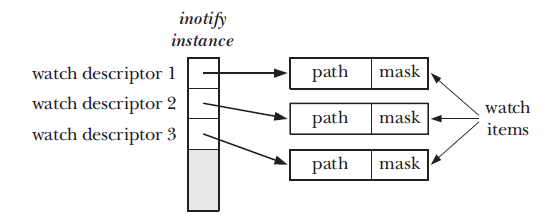

# Monitoring File Events 

## Overview 
An application that intends to monitor a file for various things that happen to it need to use the inotify API 
* The application uses the inotify_init() method to get an inotify instance. This instance is generic and can be linked with any file that we need to monitor. 
* Application inform the kernel about which files are of interest by using the inotify_add_watch() to add the items to watch list of inotify object. The inotify_add_watch() method returns a watch descriptor that is used in later operations. 
* In order to get notifications that application performs read() operations on the inotify file descriptor. this would return inotify_events to the application. 
* Once the application is done it will close the inotify file desciptor that will close all the watcher that were started earlier. 

```
#include <sys/inotify.h>

int inotify_init() 
                 returns a file descriptor on success or -1 in case of failure. 


#include <sys/inotify.h> 

int inotify_add_watch(int fd, const *char pathname, uint32_t mask); 
	Returns wath descriptor on success and -1 on error 
        fd above is file descriptor from the earlier call of inotify_init()
```
The diagram below shows how multiple watch descriptors can be part of the same inotify instance. 



Points to note: 
1. The application calling the inotify_add_watch() on a pathname must have read permissions on the pathname being passed to the method. 
2. If a pathname has not be provided to the inotify_add_watch() previously then a new watch descriptor is sent back from the method. 
3. if the pathname has been provided to the inotify_add_watch() then the mask provided by the second call is updated on the watch descriptor instance and the same wath descriptor is returned to the application. 

```
#include <sys/inotify.h> 

int inotify_rm_watch(int fd, uint32_t wd)  
	The watch descriptor wd is removed from the inotify_instance and returns 0 on success and -1 on failure. 
```

## Reading inotify Events 
Once the inotify_instance is registered we can call th read() and that would return inotify_event struct

```
struct inotify_event{
   int		wd; 
   uint32_t 	mask;    /* bits descripting the event that we are interested in for a wd*/
   uint32_t	cookie;  /* cookie for related events. */
   uint32_t 	len;     /* Size of 'name' field */ 
   char		name[];  /* Optional null terminated filename */ 
}
```
* cookie - the use case for a cookie field is where a file is renamed or moved around in the file system there are two events emitted IN_MOVED_FROM and IN_MOVED_TO and for one file both events will have one unique event that corelates them. 

* name - field comes into the picture when the pathname is for a directory and the event is regarding a file on that directory. In the case where the inotify is for a file then the name field is empty. 
 
## Queue limits and /proc Files 
notify events require queue memory on the kernel to exist until an application calls the read() operation. Therefore the kernel needs to keeps limits on the queue and these are mentioned under the /proc/sys/fs/inotify file. The following values can be mentioned: 
* max_queued_events - if the queue that holds the events become full a IN_O_OVERFLOW event is emitted and the other events are lost. 
* max_user_instanaces - this is a limit to the number of inotify instances that can be created per real user ID. 
* max_user_watches - this is the match watch descriptor that can be created per real user ID. 

default value for these configs are - 16384, 1238, 8192 

  

 
