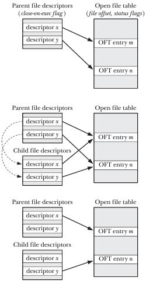
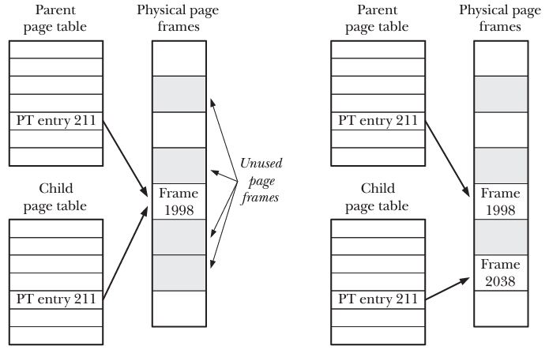

# Process Creation 

## Overview 
Lets have a look at exec(), fork(), wait() and execve()

* fork() - system call allows one process (parent) to create a new process (child). This is done by
  making the new child process (almost) an exact duplicate of the parent. The child process will
  contain copies of the parent heap and memory stack. 
* exit() - The exit library function terminates a process and releases all resources (memory, data,
  open fd) and makes them available for reallocation by the kernel. The parent process can get that
  status used to exit the process by calling the wait() system call.
* wait() - this system call has two purposes: 
	* first if a child of this process has not yet terminated by calling exit() then the current
	  process waits for the child process to exit. 
	* the termination status of the child is returned as the status agrument to the system call. 
* execve(pathname, argv, envp) - the execve system call loads a new program (at pathname, with
  argument variables argv and environment list envp) into a process's memory. The existing programs
  text is discarded and a new process stack and heap are created with the details of the new
  program. Diagram below shows how the system calls mentioned above operate 

 
The fork() system call creates a new process, the child, which is almost exactly duplicate of the
calling process, the parent. 

```
#include <unistd.h> 

pid_t fork();
	in the parent process returns process id when successful and -1 on error where as in the
	child process it always returns 0 
```
The key point to note about the fork method is that when it completes its work there are 2 processes
that exist. In each of the process that the fork system call produces the work starts from the point
where fork() returns. In the parent's stack the fork returns the pid of new child process as it
needs to mantain its children where as the child can get its pid using the getPid() method. 

Once a child is created it has its own data, stack and heap and any writes or changes to them will
not effect the parent. 

The fork might fail for various reasons but most common one is that the RLIMIT_NPROC which is the
limit to the number of processes a user id can spwan is exceeded. 

```
#Pattern for calling the fork

pid_t childPid;  
switch (childPid == fork()) {
    case -1: 
    	/* handle error as fork has failed */
    case 0: 
    	/* child of successful fork - so perform child related tasks*/
    default: 
    	/*perform the actions of the parent. */
	sleep(3); 
	break;
}
```
Another important aspect to note here is that the frok() after reutrn is indeterminate about which
process to run (child or parent) once it returns. Therefore some programs us sleep() in the parent
to enable the child to get the CPU before the parent. But this is not a fool proof way of ensuring
this consdition. 

**File sharing between parent and child** 
When a parent porcess forks a new child processes the child process inherits the data and memory
stack from the parent. This also means that the open file descriptors of the parent are shared with
the child which means that changes on the fd by the child will cause a similar change to the parent.
This use case is helpful when the parent and child both need to write to the same file. 
* if we do not want to prevent the changes from the two processes to intermiggle we can have the
  parent process call wait() and wait for the child process to end/exit. this is seen when a shell
  runs another command and wait() for it to exit before it take control of the stdout or stderr .
* If however the we want a parent and child to have different fd to point to two different locations
  on the file then we can use the following pattern where the parent 
  	* starts with 2 fd say x and y. 
	* fork() method is called and x and y are copied to child process too. 
	* the parent process closes y fd and uses just x where as child process closes x fd and uses
	  y only. 

Diagram below shows the second pattern mentioned above.  



**Memory symantics of fork()**
Conceptually the fork() call is about creating a copy of the parent text, data, heap and stack
segments. But the process of copying all the data for a parent to the child memory space is
inefficient because of: fork() is generally followed by an exec() method that will eventually replace 
the text area with the child programs text area and reinitializes the child process data, heap and stack areas. 
The kernel has a few tricks to prevent this wastage: 
* Kernel marks the text areas of both processes as read only so that both can initally point to the
  same segment until the child process is initialized using the exec(). After the exec() the kernel
  allocates the text segment to the child process. 
* For pages under the data, heap and stack segments the kernel uses a technique called copy on write
  (cow). At the time of the fork child process points to the same data, heap and stack as the parent
  and all these are marked as read only until one of either the parent or the child attempts to
  write to the page. At this time a fault occurs and the page that is attempted to be changed is
  first copied to a new location and the changing process will start pointing to the new page. This
  way we do not waste a lot of space in memory. The diagram below shows the scenario. 



Controlling a process's memory footprint 
This pattern is about controlling the memory usage of processes and this can be done using the fork
and wait() methods. This pattern ensures that the parent memory footprint is stable because it waits
for the child process to run first. 

```
pid_t childPid; 
int status; 

childPid = fork() 

if (childPid==-1){
   errExit("fork") 
} 

if (childPid==0){
   exit(func(arg))   /* the func method does some work and return exit status*/ 
} 

/*Parent waits for child to terminate. it determines the result of func() by inspecting status*/

if (wait(&status) == -1) {
   errExit("wait");
}

```


