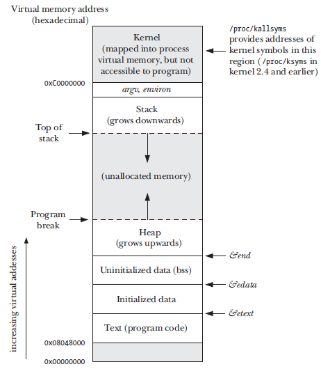
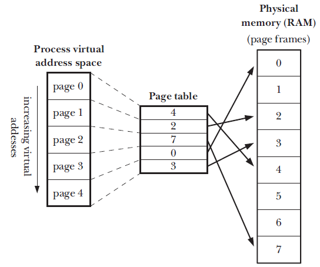

# Processes 

A process is an instance of an executing program. 

## Memory Layout of a process 
The process is allocated memory (RAM) and its composed of the following segments. 

* text segment - this segment contains the instructions for the program. This segment is marked as ready only so that the program does not override the instructions accidentally.
*  **Initialized data segment** - this contains global and static variables that are initialized in the program. *  **uninitialized data segment** - this segment contains golbal, static variables that are not explicitly initialized. 
* **stack** - this is a dynamically growing and shrinking segments containing stack frames. One stack correspondsto the number of called functions that have not returned values. 
* **heap** is an area where the variables that are created during program runtime are stored. 

## Virtual Memory Management 
Virtual memory management is a technique to make effective use of CPU and RAM(physical memory) by exploiting a property that is typical of most programs: 

* *spacial locality* - this is the tendency of the program to refer memory address that are near those that were recently accessed. 
* *temporal locality* - the tendency of the program to access same memory address in the near future that has been accessed in the recent past. 

A virtual memory scheme splits the program into small fixed size units called pages. correspondingly the RAM is divided into series of page frames that are of the same size. At any given time only a few pages need to be resident in physical memory page frames. the frames of the unused program are kept in memory area (not physical) can swaps. When a program calls page that is currently not in physical memory a page fault occurs and the kernel looks for the page in the swap area and loads it. 

> on the x86-32 machine the page size for Linux is set at 4096 bytes. However in some other machine the page size can be 8192 or 16384 bytes as well.

The mapping between the swap area and the physical memory are managed in a data structure called the page table. 

 

## Stack and stack frames 
The stack grows linearly as functions are called and returned. A special purpose register called the stack pointer tracks the current top of the stack. Each user stack contains the following information. 

* *Function arguments and local variables* - these are variables that the function created locally and the scope of these functions are only during the lifecycle of the function. The local variables are destroyed once the function returns. 

* *Call linkage information* - when a function that is currently executing calls another function the content of the program register (which contains the location of the next instruction) is copied to the function stack. This is done so that once the function returns appropriate value of the program instruction can be restored and the calling function can resume its work. 

 
