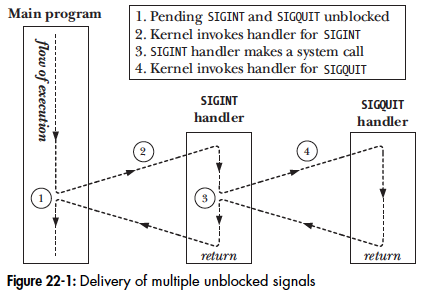

# Signal Advanced 

## Core Dump Files 
certian signals cause a process to create a core dump and terminate. the core dump file is the memory image of the process that at the time of termination of the process. This file can then be used by a debugger to have a look at the process state at the time the core dump is done. 
One of the signals that causes a core dump is the SIGQUIT signal. This can be achieved by typing the Cnt+\ which is the quit character. 

**core dump file may fail to create when:** 
1. process does not have permission to write the core dump file in the directory in which it is supposed to generate. 
2. a regular file with the same name is already present and writeable, but there are more than one hard links to it. 
3. directory to which the core dump file needs to be written too does not exist. 
4. the RLIMIT_CORE which specifies the size of the core dump file is set to 0 
5. The binary executable file that the process is executing does not have read permission enabled. this causes the core dump content not to be read from the proces.
6. file system on which the current binary resides is read only, if full or has run out of space. 
7. if the user executing the process is not the owner of the file then core dumps are not generated for reasons of security. 

**Naming the core dump file** 
the core dump file can be names based on the pattern mentioned under the file /proc/sys/kernel/core_pattern the following formatters can be used in naming the core file: 
* %c - add the core size file to the name 
* %e - executable filename (without prefix) 
* %g - real group id of dumped file. 
* %h - name of the host 
* %p - process id of the process being dumped. 
* %s - number of signal that terminated the process. 
* %t - time when the signal was issued (secs since epoch) 
* %u - real userid of dumped process 
* %% - the single % character 

## Special cases for delivery, disposition and handling

**SIGKILL and SIGSTOP** - the kill and the stop signal's default actions cannot be changed. The neither the signal() nor sigaction() can change the disposition of the two signals. there is an error thrown if an attempt to change the disposition is made. These signal cannot be blocked either. This is a deliberate design decision and these signals can always be used to kill run away processes. 

**SIGCONT** - this is the continue signal which can resume a process that has been previously halted by the SIGSTOP, SIGTSTP, SIGTTIN, SIGTTOU) 
When a SIGCONT is issued to a process it will resume the process even if it is blocked or configured to ignore SIGCONT. 

When a SIGCONT is given to a process which is stopped it stop signals are discarded. Conversely if a stop signal is delivered to a process, then an pending SIGCONT signals are discarded. 

## Interruptable and Uninterruptable Process Sleep states 
Many a times the kernel puts a process to sleep and the sleep is of two kinds: 
* TASK_INTERRUPTABLE: the process is waiting for some event. For example the process could be waiting for a terminal input from the user. The process can spend an arbitrary amount of time in this state as there is no guarantee when the user will send over the message.
* TASK_UNTERRUPTABLE: here the process is waiting to do a short but important task like writing to I/O channel. 

In the second kind of sleep state the signals like SIGKILL and SIGSTOP do not reach the process until it emerges from the state. Generally the task uninterruptable timeframes are so small the delay in delivery of signals to such processes is invisible. But if there is a hardware failure or kernel bug which hangs uninterruptable process in suspended state then it will be stuck there forever. In such a case only way is to restart the server. 

## Hardware generated signals 
SIGBUS, SIGFPE, SIGILL, SIGSEGV can be generated in the case of a hardware exception. A hardware signal is generally generated because the kernel is unsure what to do because a machine level command has failed. Therefore in order handle the hardware generated signal there are two opions. 
* accept their default action (process termination) 
* write handlers that don't perform a normal return. Because a normal return would try and resume the process that caused the hardware signal. therefore it is better to return using the siglongjmp() 

Generally signals are of two kinds the asynchronous ones (most of the signals are async in nature because the program/process cannot predict when the signal will occur) and synchronous ones which are generated by the executing process themselves. The two examples of the sync signals are: 
1. hardware signals (SIGBUS, SIGFPE, SIGILL, SIGSEGV) which are a result of a machine language instruction failing. 
2. a process can use raise(), kill() or killpg() to send a signal. 

Synchronicity is an attribute of how a signal is generated, rather than the signal itself. The same signal may be sync when generated by the same process where as it may be async if it is sent by another process. 

   
## Timing and order of signal delivery 

**When is a signal delivered** 
A signal in the case it is synchronous is delivered immediately because it is the same process that is issuing the signal using raise() method. If however a signal is async then there may be a delay between when the signal is raised and when the process may work on it because at the time the signal is raised the process may be in sleeping. 

**Order of delivery of unblocked signals**
In a process if multiple signals that are pending are unblocked they are all delivered to the process at once. Linux delivers the multiple signals in ascending order of the signal number so a SIGINT (2) will be delivered before SIGQUIT(3). 

as unblocked signals are awaiting delivery, if a switch between kernel and user mode is occurs during the execution of the signal handler, then the current signal handler is interrupted by the execution of the pendign signal. Diagram below shows how SIGINT and SIGQUIT signals which are delivered at the same time will be handled. 

 

## Realtime Signals 
Realtime signals were introduced into Linux operating systems to overcome the limitations of the standard signals. the following are the features of realtime signals
* Realtime signals have been introduced to increase the number of signals that can be used especially by the applications. There are 2 types of standard signals that can be used for defining application defined purpose. 
* Realtime signals are queued and if a realtime signal occurs multiple times then it is delivered multiple times unlike the standard signal that are delivered only once irrespective of how many times they occur for a process. 
* With realtime signals we can send data like integers or pointer values that the handlers can access. 
* Order of delivery of the realtime signal is well defined and understood. If multiple realtime signals are pending then the ones with lower signal number are delivered first. If multiple signals of the same type are pending then they are delivered in the order in which they arrive. 

**Limits on the number of queued realtime signals** 
queuing signals to be delivered later requires kernel resources to maintain therefore there is a limit that is set for managing the limit. The unfortunate part is that this implementation is different based on the distribution or unix version. 
* SUSv3 allows upper limit to be defined at 32 under the _ POSIX_SIGQUEUE_MAX 
* On linux too before kernel 2.6.7 the real time signal queue was defined under /proc/sys/kernel/rtsig-max (default 1024) where as the number of current signals queued was avaiable at /proc/sys/kernel/rtsig-nr. However post 2.6.8 release We have a constant RLIMIT_SIGPENDING that defines the manx limit. 

**Using realtime signals** 
For the process to communicate usign real time signals the following needs to be done: 
* the sending process sends the signal plus its accompanying data using the sigqueue() system call. SUSv3 allows for the realtime signals to be sent via kill() killpg() or raise() sys calls but how they will be handled is not consistent. 
* The receiving process establishes a handler for the signal using a call to sigaction() that specifies the SA_SIGINFO flag. This allows the additional data to be passed to the signal handler registered. 

#### Sending Realtime signals 
the sigqueue() syscall is the way to do this task: 

```
#include <signal.h>
int sigqueue(pid_t pid, int sig, const union sigval value) 
			// returns 0 on success or -1 on failure 
```

* Similar to kill() sigqueue() can send null signals (signal 0) to do the samething that kill does. 
* However the you cannot mention -1 under pid and hope that all the processes in the group are notified of the signal (this is the case under kill()) 

The data that can be sent with the signal is a union that has the following structure 

```
union sigval{
    int sival_int;    
    int *sival_ptr;   // pointer to the signal data.
}
```
#### Handling Realtime signals 
We can handle the signals like we do standard signals i.e. registering a handler and setting the flag SA_SIGINFO 

```
struct sigaction act; 

sigemptyset(&act.sa_mask); 
act.sa_sigaction = handler; 
act.sa_flags = SA_SIGINFO | SA_RESTART; 

if(sigaction(SIGRTMIN + 5, &act, NULL) == -1) 
	errExit("sigaction"); 
```

## Waiting for a Signal using a Mask : sigsuspend() 
Sigsuspend() is designed to handle the following use case: 
1. We temporarily block a signal so that the handler does not interrupt a critical section of the code. 
2. We unblock the signal, and then suspend the execution of the program until the signal is delivered. 

if we try to do this programatically the code so written leads to a situation of a deadlock where the program may miss a few signals. therefore to keep the above to operations atomic we have the sigsuspend()

```

int sigsuspend(const sigset_t *mask); 
	// returns a -1 with errno set to EINTR

# this is equivalent to the following code snippet. 
sigprocmask(SIG_SETMASK, &mask, &prevMask);   // assign new mask 
pause(); 
sigprocmask(SIG_SETMASK, &prevMask, NULL);  // restore the old mask. 

```

## Synchronously waiting for a Signal 
All the work tha the signal does so far has been async where the signal and the program execution act independently. However we may not require this in the case of many programs which may be ok with synchronous signals as well. The sigwaitinfo() is one such call. 

```
int sigwaitinfo(const sigset_t *set, siginfo_t *info); 
	# returns number of delivered signal on success or -1 on error 
```
The system call will cause the program to wait synchronously for one of the signals mentioned in the set to occur. if the signal in the set are already pending on the signal queue the system call immediately returns. 
The order in which the sigwaitinfo() call will pick up signals in the order going with signals with lower signal numbers first. 

Another system call that is similar to sigwaitinfo() is the sigtimedwait
```

int sigtimedwait(const sigset_t * set, siginfo_t * info, const struct timespec * timeout); 
              // returns the numebr of the signal delivered or -1 on error or time out. 
```

## Interprocess Communication with signals 
Due to various limitation mentioned below the signals are not used as a meachnism for inter process communication
1. due to the async nature of the signals in general problems like reentarant, deadlocks and correct signal handling cause quite a bit of issues however the sync signals do not have these issues but are considerably slow and block the process. 
2. Standard signals are not queued and even the real time signals which have the queing capability only have a limited amount. Also delivery of the signals in case if queue has issues of signals being clubbed. 
3. Signals hold only limited information that can be sent to the sender. 


